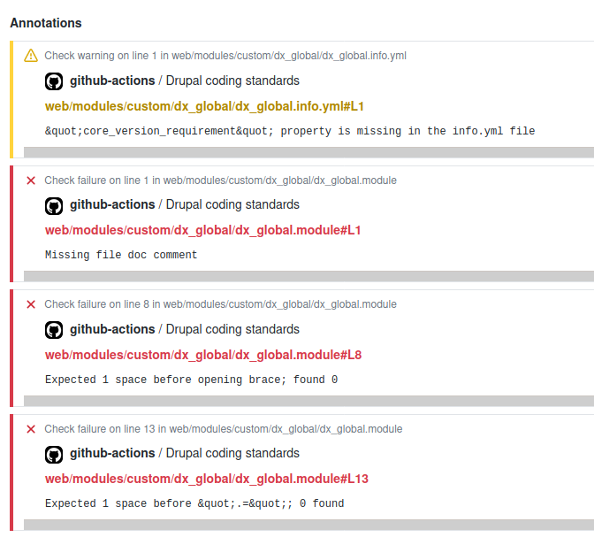

# Lightweight GitHub action to check Drupal PHP coding standards, with annotations



This GitHub action allows to check your code against the Drupal PHP coding standards.

+ It has GitHub annotations working out-of-the box, without any special token needed;
+ It's lightweight: unlike most other actions, it does NOT install all your composer dependencies. Thanks to this, a lot of GitHub action minutes can be saved over the time. Also, the action is much quicker. The downside is that the Drupal and DrupalPractice PHPCS standards are fixed and do not depend on your code base.

It uses this Docker image: https://github.com/guix77/docker-phpcs-drupal

## Requirements

+ A Drupal project following the https://github.com/drupal-composer/drupal-project structure;
+ A GitHub repository of course.

## Installation

In the root of your Drupal project, create ````phpcs.xml````:

````
<?xml version="1.0" encoding="UTF-8"?>
<ruleset name="drupal">
  <description>PHP CodeSniffer configuration for Drupal coding standards.</description>
  <file>./web/modules/custom</file>
  <file>./web/themes/custom</file>
  <arg name="extensions" value="php,module,inc,install,test,profile,theme,css,info,txt,md,yml" />
  <config name="drupal_core_version" value="8" />
  <rule ref="Drupal" />
  <rule ref="DrupalPractice" />
</ruleset>
````

In the root of your Drupal project, create ````.github/workflows/drupalCodingStandards.yml````:

````
name: Drupal coding standards

on: [pull_request]

jobs:
  phpcs-drupal:
      name: Drupal coding standards
      runs-on: ubuntu-latest
      steps:
        - uses: actions/checkout@v2
        - uses: guix77/phpcs-drupal-action@v1.0.1
````

You can customize the trigger of course (\\\\on: [pull_request]\\\\).

That's it.

## Memory limit

Optionally you could define the memory limit to use when executing phpcs. By default it is set to 128M.

````
uses: guix77/phpcs-drupal-action@v1.0.1
with:
  memory_limit: 512M
````

Define this if you get an error like: `Fatal error: Allowed memory size of...`.

## Example

+ https://github.com/guix77/d8sandbox/actions
+ https://github.com/guix77/d8sandbox/blob/master/phpcs.xml
+ https://github.com/guix77/d8sandbox/blob/master/.github/workflows/drupalCodingStandards.yml

## Credits

Inspired by https://github.com/chekalsky/phpcs-action
